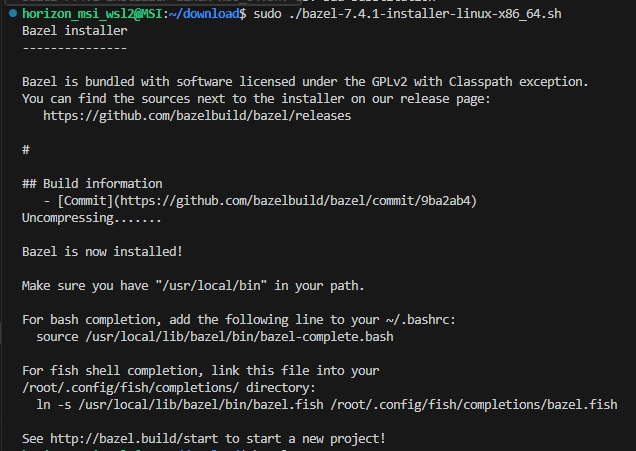

# Bazel installation.
- Get script from mirrors. Version 7.4.1 is selected, but you can get the latest version from this mirror.

```bash
wget https://mirrors.huaweicloud.com/bazel/7.4.1/bazel-7.4.1-installer-linux-x86_64.sh
```

- Chmod it.

```bash
chmod +x bazel-7.4.1-installer-linux-x86_64.sh
```

- Install bazel.

```bash
sudo ./bazel-7.4.1-installer-linux-x86_64.sh
```

