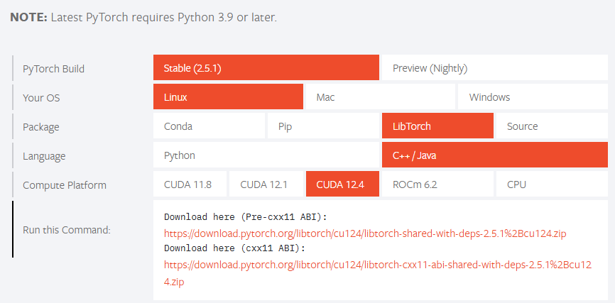

# 关于 libtorch 的依赖
首先显卡驱动得有哈，在 Terminal 里面输入 `nvidia-smi` 确认显卡驱动是否正常。如果有如下输出则是正常的。

这个库需要自行下载 libtorch 的 C++ 源码，直接去官网点击 `Get Started` 下载（[libtorch官网链接](https://pytorch.org/)）。

我这里的环境是 Windows10 WSL2 下的 Ubuntu20.04.6，显卡驱动显示的 CUDA 版本是 12.4，所以下载 CUDA 版本的 libtorch 选择如下：

当然，如果不依赖 GPU 的话，直接下载上图中的 CPU 版本的就行。

接着将对应的版本解压到指定路径（我这里是直接放在 E 盘下了），并更新此 MD 文件同一目录下的 CMakeLists.txt 的第 2 行为对应路径，就可以开始编译了。