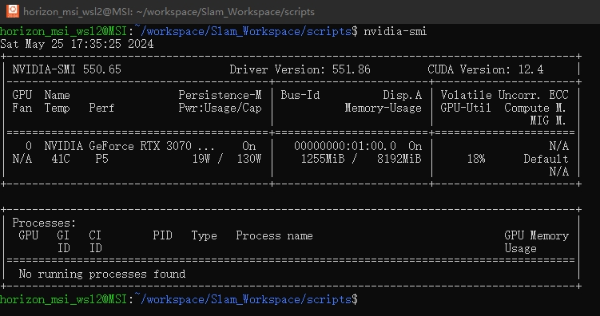

首先显卡驱动得有，在 Terminal 里面输入 `nvidia-smi` 确认显卡驱动是否正常。如果有如下输出则是正常的。


```bash
git clone --recursive https://github.com/Microsoft/onnxruntime
cd onnxruntime/
# not use cuda
./build.sh --skip_tests --config Release --build_shared_lib --parallel
# use cuda
./build.sh --skip_tests --use_cuda --config Release --build_shared_lib --parallel --cuda_home /usr/local/cuda-12.5 --cudnn_home /usr/local/cuda-12.5
```
